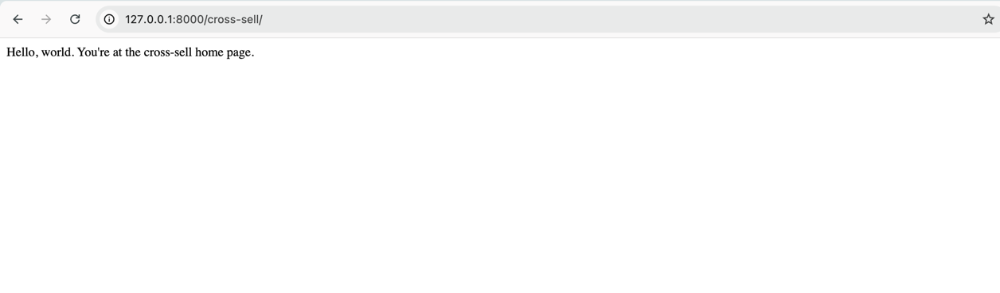

## About
hephestos is a suite of tools/apps created in Django for Shopify ecosystem.
#### Current apps
CrossSell(External): Lets a merchant define workflow for marketing product B if they sold product A
<br>Core(Internal): Engine for executing workflows
<br>Shopify(Internal): App for logic pertaining to Shopify APIs and data

## hephestos dev setup MacOS
We are using docker to manage setup.
(TODO: Add setup commands for Windows OS)

### Clone Project
#### SSH remote repository
```sh
git clone git@github.com:hephestos-tools/hephestos.git
cd hephestos
```

#### Install Docker (ignore if already installed)
https://docs.docker.com/desktop/install/mac-install/

### Build the app
This command will pull official image of postgres:16 and build a new image of hephestos. Install python and project dependencies.
```commandline
docker-compose build
```

### Run the app
This step will:
1. Startup the postgres db image
2. Run db migrations (if any migration files are added in the project)
3. Start google pub-sub subscriber
4. Start the webserver on [0.0.0.0:8000]() 
```commandline
docker-compose up
```
Use `-d` flag when you want to access the terminal and let docker run in background. <br/><br/>
**To stop the server run** `docker-compose down`

##### Check running docker processes
```commandline
docker ps
```
Image Names:<br/>
`hephestos-db-1` (Database)<br/>
`hephestos-web-1`(Web App)
##### Check image logs
```commandline
docker logs <image-name>
```

### Test if app started up okay
In your browser open http://127.0.0.1:8000/cross-sell/ and you should see something like this if your setup is successful:



### Access DB image
This command will open the Postgres DB server using bash where you can run psql commands
```commandline
docker exec -it hephestos-db-1 bash
```
PSQL Command to access DB<br/>

- Logs in using default postgres user
```commandline
psql -U postgres -d hephestos
```

#### Some common psql commands
- Run these after logging into psql command line
```psql
\dt  -- List all tables in the current database
\d table_name  -- Describe table structure
\x -- for expanded output format when data is wide
```
- To do manual transactions for testing.
```sql
BEGIN;  -- Start a transaction
UPDATE users SET email = 'new@example.com' WHERE name = 'Alice';
ROLLBACK;  -- Undo the transaction
COMMIT;  -- Save the transaction
```

### Creating and Running DB migrations using Django
Your project should be running.
1. If you need to add/edit/drop a column in one of the tables, 
then you just need to edit the corresponding model defined in e.g. `<app>/models.py`, then run:<br/>
    ```
    docker exec -it hephestos-web-1 python manage.py makemigrations <app>
    ```
    This will create a new file under `<app>/migrations directory`<br/>
2. Restart your server - this will run any new migrations, check logs for any failures, if you find any bugs, you can delete the migration file created in Step 1 and regenerate a new one.
    ```commandline
    docker compose restart
    ```

