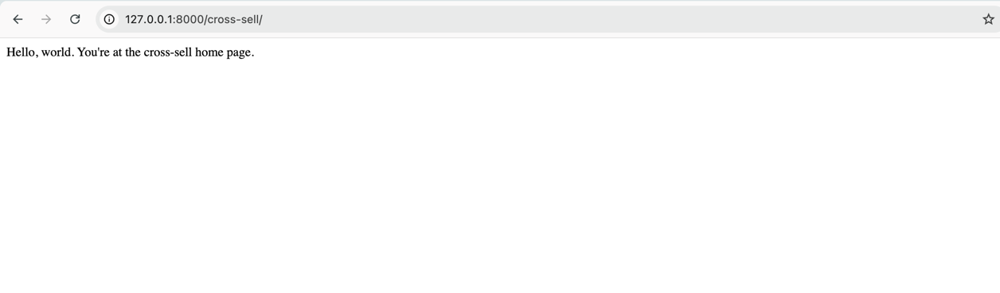

## hephestos dev setup MacOS
In shell, run each command and proceed once the previous one is success

### Install Project
#### SSH remote repository
```sh
git clone git@github.com:hephestos-tools/hephestos.git
cd hephestos
```
#### Installing python3 (skip if already installed)
```commandline
brew install python@3.12
```
#### venv setup
```commandline
python3 -m venv .venv
source .venv/bin/activate
```
#### Install python requirements 
```commandline
pip install --upgrade pip
pip install -r requirements.txt
```

### Database Setup
#### Install Postgres@15
```commandline
brew install postgresql@15
```

#### Update path once postgres is installed
Check your default bash file
for e.g. if .zshrc
Open .zshrc using vim or nano and add the below line in the file.
```commandline
export PATH="/opt/homebrew/opt/postgresql@15/bin:$PATH"
```
Once file is saved and closed.
```commandline
source ~/.zshrc
```
* Start postgres server on local using command
  ```commandline
  brew services start postgresql@15
  ```
Check if you are able to access psql by running the command `psql -U postgres`
if you get an error: psql: error: connection to server on socket "/tmp/.s.PGSQL.5432" failed: FATAL:  role "postgres" does not exist
It means the postgres server was setup with your mac username as default, in that case run:
```commandline
psql -U <your-mac-username>
```
This will log you into default postgres db
* Create a generic superuser:
  ```commandline
  CREATE ROLE postgres WITH LOGIN SUPERUSER PASSWORD '';
  ```

#### Create Database
  ```commandline
  sudo psql -U postgres -c "CREATE DATABASE hephestos;"
  ```

### Run setup migration
This step will create the tables in your database `hephestos`
<br>Replace <your-workspace> with the folder where you have cloned the repository
```commandline
cd <your-workspace>/hephestos
python manage.py migrate
```


### Run Server
Check if your app is correctly setup by running the following command
```commandline
python manage.py runserver
```

In your browser open http://127.0.0.1:8000/cross-sell/ and you should see something like this:
